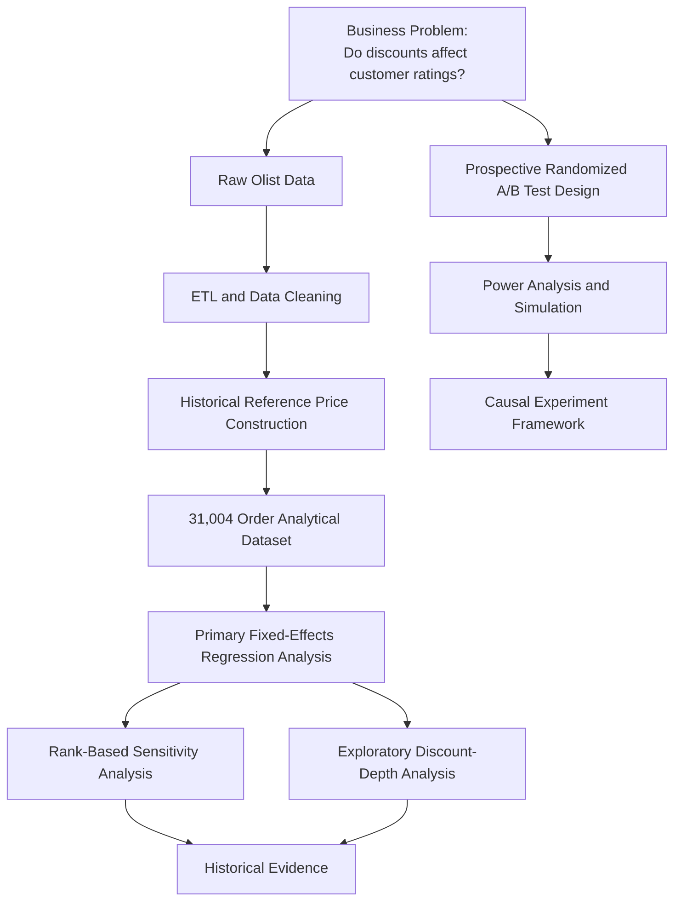

# Do Discounts Affect Customer Ratings?
*Experiment Design & Observational Analysis of Olist E-Commerce Data*

This project explores the relationship between discounting and customer reviews. It uses a real-world public e-commerce dataset published by Olist Store. 

More information can be found here: https://www.kaggle.com/datasets/olistbr/brazilian-ecommerce.

### Business Problem
Discounts and promotions are among the most widely used tools in e-commerce. They create a sense of opportunity that drives customers to purchase products that they wouldn't have otherwise, but what if chasing short-term sales volume through discounting risks long-term customer perception of a product?

Many consumers may assume that a product is discounted because it is not selling well, and it is not selling because there may be something wrong with it. However, others may see the discount and be happy to get a good deal, and be more lenient when rating the product itself.

This raises an interesting question about customer psychology: **If a customer pays less than a product's historical reference price, does that alter how they evaluate the product after purchase?**

### Results
After accounting for seller-product and month fixed effects, the primary analysis determined that if a product is discounted, it is associated with a 0.008 rating-point increase in how the product is reviewed on average. The 95% confidence interval ranged from -0.057 to 0.074 rating points, representing the range of association sizes reasonably supported by the data.

We had pre-specified a practical threshold of a 0.3 rating point difference, but given that our entire confidence interval is inside the range of -0.3 to 0.3, **the historical analysis found no evidence of a materially meaningful association between discounting and customer ratings**. A rank-based approach and dose-response analysis were qualitatively consistent with the primary analysis.

Given that our historical data were not generated through random assignment, we cannot claim causality between discounting and customer ratings. Therefore, the project proposes a randomized A/B test that Olist could use to estimate the causal effect of discounting on customer ratings in the future.

### Methodology

