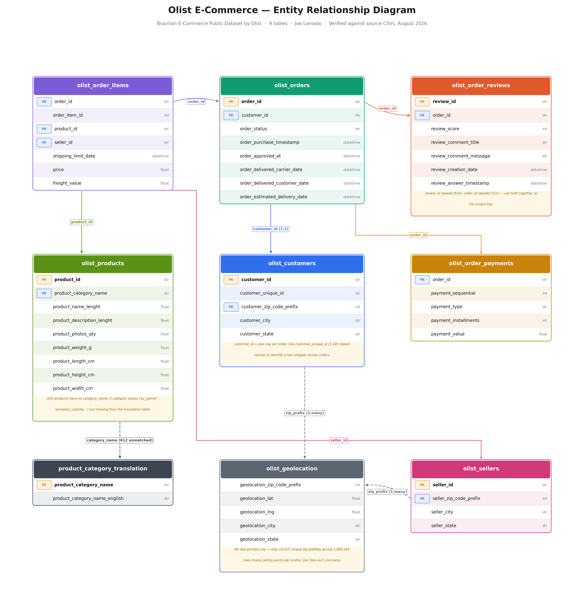

# Do Discounts Affect Customer Ratings?
*Experiment Design & Observational Analysis of Olist E-Commerce Data*

This project explores the relationship between discounting and customer reviews. It uses a real-world public e-commerce dataset published by Olist Store. 

More information can be found here: [Brazilian E-Commerce Public Dataset by Olist](https://www.kaggle.com/datasets/olistbr/brazilian-ecommerce).

## Business Problem
Discounts and promotions are among the most widely used tools in e-commerce. They create a sense of opportunity that drives customers to purchase products that they wouldn't have otherwise, but what if chasing short-term sales volume through discounting risks long-term customer perception of a product?

Many consumers may assume that a product is discounted because it is not selling well, and it is not selling because there may be something wrong with it. However, others may see the discount and be happy to get a good deal, and be more lenient when rating the product itself.

This raises an interesting question about customer psychology: **If a customer pays less than a product's historical reference price, does that alter how they evaluate the product after purchase?**

## Results
After accounting for seller-product and month fixed effects, discounted purchases were associated with ratings 0.008 points higher on average. The 95% confidence interval ranged from -0.057 to 0.074 rating points, representing the range of association sizes reasonably supported by the data. The p-value was $p=0.804$.

We had pre-specified a practical threshold of a 0.3 rating point difference, but given that our entire confidence interval is inside the range of -0.3 to 0.3, **the historical analysis found no evidence of a materially meaningful association between discounting and customer ratings**. A rank-based approach and dose-response analysis were qualitatively consistent with the primary analysis.

Given that our historical data were not generated through random assignment, we cannot claim causality between discounting and customer ratings. Therefore, the project proposes a randomized A/B test that Olist could use to estimate the causal effect of discounting on customer ratings in the future.

## Methodology


### Data Preparation and Feature Engineering
The full ETL pipeline for the raw dataset was implemented using SQL with DuckDB in Python. The full process can be found here:

➡️ **[Launch ETL Pipeline Notebook](./ETL.ipynb)**

A summary of the entire process can be seen below: 
| Step  | # of Rows | Description  |
|-------|-------|--------|
| Raw Data   | 99,441  | Start with the complete Olist orders table.    |
| Analysis Window & Customer Selection   | 70,054  | Keep delivered orders from Aug. 1, 2017 - Jul. 31, 2018 and retain the first eligible order per customer.   |
| Orders with Ratings   | 69,589  | Require a customer review score.     |
| Single-Item Orders   | 62,658   | Restrict the analysis to orders containing a single item.     |
| Seller-Product Enrichment   | 62,658   | Add product, seller, and price information needed to construct seller-product pricing history.|
| Final Analytical Dataset   | **31,004**   | Construct historical reference prices and discount depth using strictly prior seller-product price observations, requiring at least three prior observations.     |

Because the original dataset does not contain a discount variable, discount % was engineered by comparing each order's price with the maximum strictly prior observed price for the same seller-product pair. Orders with a discount depth of at least 1% were classified as discounted.

### Analysis
The full analysis can be found here:

➡️ **[Launch Analysis Notebook](./olist_discount_ratings_analysis.ipynb)**

The analysis methodology consisted of a primary analysis using a Fixed-Effects Regression accounting for seller-product and month effects, a secondary sensitivity analysis to compare the unadjusted association between discounts and customer rating, and an exploratory dose-response analysis. 

For the Fixed-Effects Regression, we used discounted vs non-discounted as our main predictor variable. We used this type of regression to control for persistent differences between individual seller-product combinations and month-to-month changes over time. Standard errors were clustered by seller-product pair to account for dependence within those groups. We then performed a Mann-Whitney U test on the unadjusted data as a sensitivity measure to compare the unadjusted customer-rating distributions between the two groups. Finally, a dose-response analysis was performed using Kruskal-Wallis to evaluate different discount levels and their relationship with ratings. 

### Proposed Randomized A/B Test
The project proposes a randomized A/B test to estimate the causal effect of discounting on customer ratings. It defines the following parameters:
- **Unit of randomization**: Customer, randomly assigned 50/50 between control and treatment.
- **Control Group**: Customers assigned to the standard pricing experience.
- **Treatment Group**: Customers assigned a predefined discount offer.
- **Primary Metric**: Customer ratings, an ordinal 1-5 rating given by each customer.
- **Primary Test**: Welch two-sample t-test with a 95% confidence interval.
- **Significance: $\alpha$** = 0.05
- **Statistical Power**: (1 - $\beta$) = 0.80
- **Minimum detectable effect (MDE)**: 0.3 rating points
- **Duration & Stopping Rule**: Run for at least one full weekly cycle and continue until the sample requirement is reached, with a fixed review follow-up period. Do not stop early based on interim statistical significance.

We use the historical standard deviation of ratings to calculate Cohen's d and use our experiment parameters in our power analysis to determine the minimum required observed ratings (**274 per group**) for our experiment. Because not every randomized customer will purchase and submit a review, the number of customers randomized would need to be larger. 

In addition to ratings, the experiment should monitor conversion, review completion, and contribution margin per randomized customer to ensure that any rating impact is interpreted alongside the commercial effects of discounting.

## Data
This project uses the Brazilian E-Commerce Public Dataset by Olist, a real-world relational e-commerce dataset containing information on orders, customers, products, sellers, reviews, payments, and delivery activity. The ER diagram can be seen below:



The historical analysis focuses on purchases from August 1, 2017 through July 31, 2018. After applying the analytical eligibility criteria and constructing the historical pricing features, the final dataset contains 31,004 orders.

The source data do not include a discount indicator. Discount depth was therefore engineered from each seller-product pair's strictly prior observed pricing history.

Dataset: [Brazilian E-Commerce Public Dataset by Olist](https://www.kaggle.com/datasets/olistbr/brazilian-ecommerce)


## Skills Demonstrated

- **Data Engineering:** SQL, DuckDB, ETL pipeline design, relational joins, cohort construction, leakage-safe feature engineering
- **Statistical Analysis:** fixed-effects regression, clustered standard errors, confidence intervals, hypothesis testing, practical significance, nonparametric analysis
- **Experimentation:** randomized A/B test design, power analysis, minimum detectable effect, simulation, guardrail metrics
- **Causal Reasoning:** distinguishing observational associations from causal effects and identifying limitations of historical data
- **Tools:** Python, pandas, NumPy, SciPy, PyFixest, matplotlib, seaborn
- **Reproducibility & Communication:** documented ETL and analysis workflows, dependency management, and translation of statistical results into business recommendations

## Repository Structure

```text
olist-discount-ratings-analysis/
├── README.md
├── ETL.ipynb
├── olist_discount_ratings_analysis.ipynb
├── requirements.txt
├── .gitignore
├── figures/
└── data/
    └── README.md
```
- **ETL.ipynb**: Builds the analytical dataset from the raw Olist relational tables, including historical reference-price and discount-depth features.
- **olist_discount_ratings_analysis.ipynb**: Contains the observational statistical analysis, sensitivity analyses, proposed randomized A/B test, power analysis, and simulation.
- **figures/**: Visuals used in this README.
- **data/README.md**: Instructions for obtaining and organizing the source data.
- **requirements.txt**: Python dependencies required to reproduce the project.

## Reproducing the Analysis

### 1. Clone the repository

```bash
git clone https://github.com/joelaniado/olist-discount-ratings-analysis.git
cd olist-discount-ratings-analysis
```

### 2. Create a Python environment

```bash
python -m venv .venv
source .venv/bin/activate
```
On Windows:

```bash
python -m venv .venv
.venv\Scripts\activate
```

### 3. Install dependencies

```bash
pip install -r requirements.txt
```

### 4. Download the data

Download the **Brazilian E-Commerce Public Dataset by Olist**:

[Brazilian E-Commerce Public Dataset by Olist](https://www.kaggle.com/datasets/olistbr/brazilian-ecommerce)

Place all CSV files in the local raw data directory as described in [raw_data/README.md`](raw_data/README.md).

Raw source data are not included in this repository.

### 5. Launch JupyterLab

From the repository directory, run:

```bash
jupyter lab
```

JupyterLab will open in your web browser.

### 6. Run the ETL pipeline

Open:

ETL.ipynb

Then select Run -> Run All Cells.

The ETL pipeline will create:

data/clean_sales_data.csv

### 7. Run the analysis

After the ETL notebook completes successfully, open:

olist_discount_ratings_analysis.ipynb

Select Run -> Run All Cells to reproduce the observational analysis, sensitivity analyses, randomized experiment design, power analysis, and simulation.